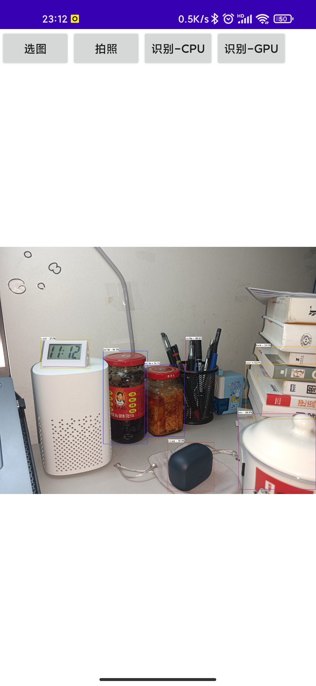

# ncnn-android-yolov5

使用ncnn的拍照识别app

https://github.com/Tencent/ncnn

## 构建
### step1

从 https://github.com/Tencent/ncnn/releases 下载 `ncnn-android-vulkan.zip`

或者自行编译 https://github.com/Tencent/ncnn/wiki/how-to-build#build-for-android

### step2

将 `ncnn-android-vulkan.zip` 解压到 `app/src/main/jni` 目录下

确保 `app/src/main/jni/CMakeLists.txt` 中的路径设置正确

### step3

用 `Android Studio` 打开此项目, 然后构建它。

## 效果

